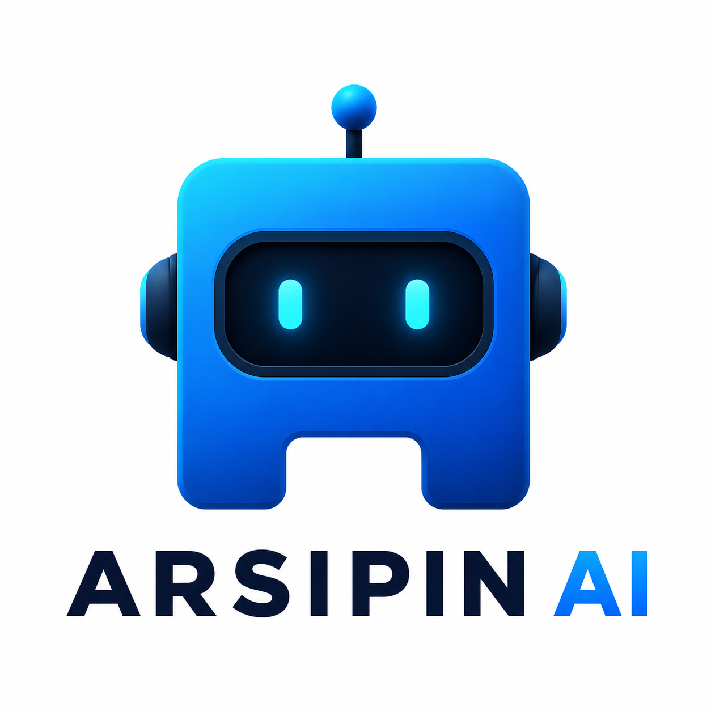

<h1>
  
  Arsipin WhatsApp Drive Bot
</h1>

Arsipin adalah bot WhatsApp grup untuk mengarsipkan media (gambar dan video) ke Google Drive.
Bot hanya memproses pesan command yang diawali `/`.

## Fitur Utama

- Upload media (gambar/video) ke Google Drive via command WhatsApp.
- Mendukung reply ke media dengan `/kirim ...`.
- Fallback ke kumpulan media terbaru jika tidak reply.
- OAuth Google Drive menggunakan akun user.
- Struktur kode dipisah agar mudah dirawat:
  - `src/index.js` untuk bot WhatsApp, command, dan resolver media.
  - `src/gdrive.js` untuk autentikasi dan upload Google Drive.

## Stack

- Node.js (ESM, `import` syntax)
- [`whatsapp-web.js`](https://github.com/pedroslopez/whatsapp-web.js)
- Google Drive API (`googleapis`) dengan OAuth user
- `@google-cloud/local-auth` untuk flow login lokal OAuth

## Prasyarat

- Node.js 18+ (disarankan LTS terbaru).
- NPM.
- Akun Google dengan akses ke folder Drive tujuan.
- OAuth Client Credentials (`client_secrets.json`) dari Google Cloud Console.
- WhatsApp aktif untuk scan QR saat pertama kali login.

## Instalasi

1. Clone repository:

```bash
git clone https://github.com/abdridwan/arsipin.git
cd arsipin
```

2. Install dependency:

```bash
npm install
```

3. Siapkan file environment `.env`:

```env
DRIVE_ROOT_FOLDER_ID=isi_folder_id_google_drive
GD_CLIENT_SECRETS_FILE=./client_secrets.json
GD_TOKEN_FILE=./token.json
```

4. Pastikan file `client_secrets.json` tersedia di root project (atau sesuaikan path di `.env`).

## Menjalankan Bot

Saat ini script npm khusus belum didefinisikan, jadi jalankan langsung:

```bash
node src/index.js
```

Saat startup:

- Terminal menampilkan QR code.
- Scan QR dari akun WhatsApp bot.
- Session akan disimpan di folder `.wwebjs_auth` (jangan dihapus jika ingin tetap login).

## Cara Penggunaan di Grup WhatsApp

Bot aktif hanya di grup dan hanya untuk pesan yang diawali `/`.

Command utama:

- `/menu` menampilkan daftar command.
- `/ping` cek bot aktif.
- `/kirim [instruksi]` upload media (gambar/video, video maks 100 MB).
- `/pilih <nomor>` memilih folder saat bot minta konfirmasi.
- `/reset` reset antrian media user di grup tersebut.

Flow upload:

1. Kirim satu atau beberapa media (gambar/video) ke grup.
2. Jalankan `/kirim ...`:

- Jika command adalah reply ke media: bot pakai media/relevansi album dari reply.
- Jika bukan reply: bot ambil media terbaru (dengan fallback seluruh pengirim di grup bila perlu).
- Video di atas 100 MB akan dilewati otomatis.

3. Bot memilih folder tujuan (heuristik/AI saat tersedia, atau minta `/pilih` jika perlu).
4. Bot upload ke Google Drive.

## Catatan OAuth Google Drive

- Bot menggunakan OAuth user (installed app flow), bukan service account.
- Token disimpan di `GD_TOKEN_FILE` (`./token.json` default).
- Jika token bermasalah/izin kurang:
  - hapus `token.json`
  - jalankan bot lagi
  - login ulang saat diminta

## Troubleshooting Singkat

- `DRIVE_ROOT_FOLDER_ID belum di-set`: isi variabel env dengan ID folder Drive yang valid.
- `Folder root tidak ditemukan/tidak bisa diakses`: pastikan akun OAuth punya akses folder tersebut.
- Media reply tidak bisa diunduh: buka media di WhatsApp lalu kirim command lagi.
- Video tidak terupload: pastikan ukuran file tidak melebihi 100 MB.
- Bot tidak merespons: pastikan command diawali `/` dan dikirim di grup, bukan chat personal.

## Keamanan dan Praktik Baik

- Jangan commit file rahasia seperti `client_secrets.json`, `token.json`, dan `.env`.
- Jangan hapus folder `.wwebjs_auth` jika ingin mempertahankan sesi login.
- Batasi akses folder Google Drive sesuai kebutuhan operasional.

## Roadmap Singkat

- Integrasi Gemini untuk pemilihan folder yang lebih cerdas.
- Penyempurnaan UX command untuk upload bulk dan validasi konteks.
- Penambahan script npm (`start`, `dev`) dan test.

## License

Project ini menggunakan lisensi **ISC** (mengikuti `package.json` saat ini).

## Copyright

Copyright (c) 2026 abdridwan.
Arsipin dikembangkan untuk otomatisasi pengarsipan dokumentasi melalui WhatsApp dan Google Drive.
